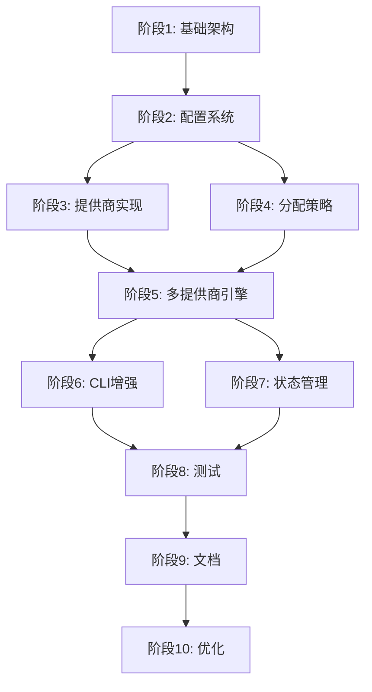

# 多 LLM 提供商实施任务清单（8倍粒度）

> 本清单将实施任务拆解为约 100 个细粒度子任务，便于精确追踪进度

## 阶段 1：基础架构搭建（25 个任务）

### 1.1 目录结构创建（5 个任务）
- [ ] 创建 `casecraft/core/providers/` 目录
- [ ] 创建 `casecraft/core/providers/__init__.py` 文件
- [ ] 创建 `tests/providers/` 测试目录
- [ ] 创建 `tests/providers/__init__.py` 文件
- [ ] 更新 `.gitignore` 排除提供商特定的临时文件

### 1.2 抽象基类设计（8 个任务）
- [ ] 创建 `providers/base.py` 文件
- [ ] 定义 `LLMProvider` 抽象基类
- [ ] 实现 `name` 属性接口
- [ ] 定义 `generate()` 抽象方法
- [ ] 定义 `get_max_workers()` 抽象方法
- [ ] 定义 `validate_config()` 抽象方法
- [ ] 定义 `health_check()` 抽象方法
- [ ] 添加基类的日志记录器初始化

### 1.3 响应模型设计（4 个任务）
- [ ] 扩展 `LLMResponse` 模型添加 provider 字段
- [ ] 添加 `ProviderMetadata` 数据类
- [ ] 实现响应合并方法
- [ ] 添加响应验证逻辑

### 1.4 异常处理设计（4 个任务）
- [ ] 创建 `ProviderError` 基础异常类
- [ ] 创建 `ProviderNotFoundError` 异常
- [ ] 创建 `ProviderConfigError` 异常
- [ ] 创建 `ProviderHealthCheckError` 异常

### 1.5 注册器实现（4 个任务）
- [ ] 创建 `providers/registry.py` 文件
- [ ] 实现 `ProviderRegistry` 类
- [ ] 实现 `register()` 方法
- [ ] 实现 `get_provider()` 单例方法

## 阶段 2：配置系统扩展（20 个任务）

### 2.1 配置模型扩展（6 个任务）
- [ ] 创建 `models/provider_config.py` 文件
- [ ] 定义 `ProviderConfig` 基础配置类
- [ ] 定义 `MultiProviderConfig` 配置类
- [ ] 添加配置验证器
- [ ] 实现配置序列化方法
- [ ] 实现配置反序列化方法

### 2.2 环境变量解析（8 个任务）
- [ ] 扩展 `config_manager.py` 支持多提供商
- [ ] 实现 `CASECRAFT_PROVIDERS` 解析
- [ ] 实现 `CASECRAFT_{PROVIDER}_MODEL` 解析
- [ ] 实现 `CASECRAFT_{PROVIDER}_API_KEY` 解析
- [ ] 实现 `CASECRAFT_{PROVIDER}_BASE_URL` 解析
- [ ] 实现 `CASECRAFT_{PROVIDER}_WORKERS` 解析
- [ ] 实现策略相关配置解析
- [ ] 实现降级链配置解析

### 2.3 配置验证（3 个任务）
- [ ] 实现提供商配置完整性验证
- [ ] 实现 API Key 存在性验证
- [ ] 实现并发数合理性验证

### 2.4 配置处理（3 个任务）
- [ ] 实现提供商未指定时的错误提示
- [ ] 实现配置合并逻辑
- [ ] 实现配置优先级处理

## 阶段 3：提供商实现（32 个任务）

### 3.1 GLM Provider 重构（8 个任务）
- [ ] 创建 `providers/glm_provider.py` 文件
- [ ] 将现有 `LLMClient` 重构为 `GLMProvider`
- [ ] 实现 `generate()` 方法适配
- [ ] 实现 `get_max_workers()` 返回 1
- [ ] 实现 `validate_config()` 方法
- [ ] 实现 `health_check()` 方法
- [ ] 迁移流式响应处理逻辑
- [ ] 迁移重试机制

### 3.2 Qwen Provider 实现（8 个任务）
- [ ] 创建 `providers/qwen_provider.py` 文件
- [ ] 实现 `QwenProvider` 类
- [ ] 实现通义千问 API 调用逻辑
- [ ] 实现 `generate()` 方法
- [ ] 实现 `get_max_workers()` 返回 3
- [ ] 实现 `validate_config()` 方法
- [ ] 实现 `health_check()` 方法
- [ ] 添加千问特定的错误处理

### 3.3 Kimi Provider 实现（8 个任务）
- [ ] 创建 `providers/kimi_provider.py` 文件
- [ ] 实现 `KimiProvider` 类
- [ ] 实现 Moonshot API 调用逻辑
- [ ] 实现 `generate()` 方法
- [ ] 实现 `get_max_workers()` 返回 2
- [ ] 实现 `validate_config()` 方法
- [ ] 实现 `health_check()` 方法
- [ ] 实现 OpenAI 兼容接口适配

### 3.4 Local Provider 实现（8 个任务）
- [ ] 创建 `providers/local_provider.py` 文件
- [ ] 实现 `LocalProvider` 类
- [ ] 实现 Ollama API 调用逻辑
- [ ] 实现 vLLM API 兼容逻辑
- [ ] 实现 `generate()` 方法
- [ ] 实现可配置的 `get_max_workers()`
- [ ] 实现 `validate_config()` 方法
- [ ] 实现 `health_check()` 方法

## 阶段 4：分配策略实现（12 个任务）

### 4.1 策略基础（3 个任务）
- [ ] 创建 `providers/strategies/` 目录
- [ ] 创建 `strategies/base.py` 策略基类
- [ ] 定义策略接口规范

### 4.2 轮询策略（2 个任务）
- [ ] 创建 `strategies/round_robin.py`
- [ ] 实现 `RoundRobinStrategy` 类

### 4.3 随机策略（2 个任务）
- [ ] 创建 `strategies/random.py`
- [ ] 实现 `RandomStrategy` 类

### 4.4 复杂度策略（3 个任务）
- [ ] 创建 `strategies/complexity_based.py`
- [ ] 实现复杂度计算算法
- [ ] 实现基于复杂度的分配逻辑

### 4.5 手动映射策略（2 个任务）
- [ ] 创建 `strategies/manual.py`
- [ ] 实现映射解析和应用

## 阶段 5：多提供商引擎（15 个任务）

### 5.1 引擎核心（5 个任务）
- [ ] 创建 `core/multi_provider_engine.py`
- [ ] 实现 `MultiProviderEngine` 类
- [ ] 实现提供商初始化逻辑
- [ ] 实现端点分组方法
- [ ] 实现结果合并方法

### 5.2 并发执行（5 个任务）
- [ ] 实现 `generate_with_providers()` 方法
- [ ] 实现基于信号量的并发控制
- [ ] 实现任务分发逻辑
- [ ] 实现异步任务收集
- [ ] 实现进度追踪

### 5.3 故障处理（5 个任务）
- [ ] 创建 `providers/fallback.py`
- [ ] 实现 `FallbackHandler` 类
- [ ] 实现降级链逻辑
- [ ] 实现重试机制集成
- [ ] 实现错误记录和报告

## 阶段 6：CLI 增强（12 个任务）

### 6.1 命令参数（6 个任务）
- [ ] 添加 `--provider` 参数
- [ ] 添加 `--providers` 参数
- [ ] 添加 `--provider-map` 参数
- [ ] 添加 `--strategy` 参数
- [ ] 实现参数验证逻辑（必须指定提供商）
- [ ] 实现参数解析逻辑

### 6.2 命令处理（4 个任务）
- [ ] 更新 `generate_command.py` 支持新参数
- [ ] 实现未指定提供商时的错误提示
- [ ] 实现提供商选择逻辑
- [ ] 实现策略应用逻辑

### 6.3 帮助文档（3 个任务）
- [ ] 更新命令帮助信息
- [ ] 添加使用示例
- [ ] 更新 `--help` 输出

## 阶段 7：状态管理增强（8 个任务）

### 7.1 状态模型（3 个任务）
- [ ] 扩展状态模型支持提供商信息
- [ ] 添加提供商使用统计
- [ ] 添加降级记录字段

### 7.2 状态持久化（3 个任务）
- [ ] 更新状态文件格式版本
- [ ] 实现向后兼容的状态读取
- [ ] 实现新格式的状态写入

### 7.3 统计报告（2 个任务）
- [ ] 实现按提供商的统计汇总
- [ ] 实现成本估算功能

## 阶段 8：测试实现（15 个任务）

### 8.1 单元测试（8 个任务）
- [ ] 创建 `test_glm_provider.py`
- [ ] 创建 `test_qwen_provider.py`
- [ ] 创建 `test_kimi_provider.py`
- [ ] 创建 `test_local_provider.py`
- [ ] 创建 `test_registry.py`
- [ ] 创建 `test_strategies.py`
- [ ] 创建 `test_fallback.py`
- [ ] 创建 `test_multi_provider_engine.py`

### 8.2 集成测试（4 个任务）
- [ ] 创建多提供商并发测试
- [ ] 创建故障转移测试
- [ ] 创建端到端生成测试
- [ ] 创建性能基准测试

### 8.3 测试数据（3 个任务）
- [ ] 创建模拟 API 响应数据
- [ ] 创建测试用 OpenAPI 规范
- [ ] 创建测试配置文件

## 阶段 9：文档和示例（8 个任务）

### 9.1 文档更新（4 个任务）
- [ ] 更新 README.md 添加多提供商说明
- [ ] 创建提供商配置指南
- [ ] 创建迁移指南
- [ ] 更新 API 文档

### 9.2 示例配置（4 个任务）
- [ ] 创建 `.env.example` 包含所有提供商
- [ ] 创建单提供商配置示例
- [ ] 创建多提供商配置示例
- [ ] 创建高级配置示例

## 阶段 10：优化和清理（7 个任务）

### 10.1 代码优化（3 个任务）
- [ ] 优化内存使用
- [ ] 优化并发性能
- [ ] 优化日志输出

### 10.2 代码清理（2 个任务）
- [ ] 移除废弃代码
- [ ] 统一代码风格

### 10.3 最终验证（2 个任务）
- [ ] 运行完整测试套件
- [ ] 执行端到端验证

---

## 任务统计

- **总任务数**: 104 个
- **阶段 1**: 25 个任务（基础架构）
- **阶段 2**: 20 个任务（配置系统）
- **阶段 3**: 32 个任务（提供商实现）
- **阶段 4**: 12 个任务（分配策略）
- **阶段 5**: 15 个任务（多提供商引擎）
- **阶段 6**: 13 个任务（CLI 增强）
- **阶段 7**: 8 个任务（状态管理）
- **阶段 8**: 15 个任务（测试）
- **阶段 9**: 8 个任务（文档）
- **阶段 10**: 7 个任务（优化）

## 时间估算

按每个任务平均 0.5-2 小时计算：
- **最快完成时间**: 50 小时（约 1.5 周全职开发）
- **正常完成时间**: 150 小时（约 4 周全职开发）
- **保守估计**: 200 小时（约 5 周全职开发）

## 优先级建议

### P0（必须完成）
- 阶段 1：基础架构
- 阶段 2：配置系统
- 阶段 3.1：GLM Provider 重构
- 阶段 5：多提供商引擎

### P1（核心功能）
- 阶段 3.2-3.4：其他提供商实现
- 阶段 4：分配策略
- 阶段 6：CLI 增强

### P2（完善功能）
- 阶段 7：状态管理
- 阶段 8：测试
- 阶段 9：文档
- 阶段 10：优化

## 依赖关系

## 风险点

1. **提供商 API 差异**：不同提供商的 API 格式可能差异较大
2. **并发控制复杂性**：需要精确控制各提供商的并发数
3. **错误处理**：需要处理各种异常情况
4. **向后兼容**：需要确保不破坏现有功能

## 验收标准

每个任务完成需满足：
1. 代码实现完成
2. 单元测试通过
3. 代码审查通过
4. 文档更新完成

## 使用说明

1. 将此清单复制到项目管理工具
2. 按优先级和依赖关系安排任务
3. 每完成一个任务，标记 [x]
4. 定期更新进度和时间估算